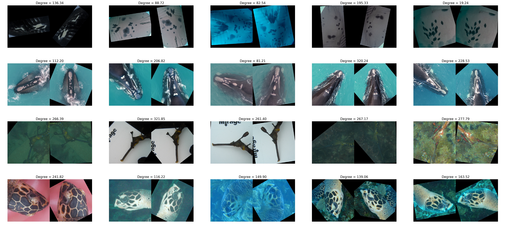

# IBEIS 2D Orientation Plug-in
An wbia plug-in wrapper for https://github.com/hgrov52/2D-Orientation-v2#plugin



# Requirements

* OpenCV (cv2)
* PyTorch and TorchVision
* Numpy
* Pandas
* Matlotlib
* IBEIS and related dependencies: wbia, utool, vtool, dtool, plottool
* TQDM
* ArgParse
* SciKit Learn and SciKit Image

# Installation

Install this plug-in as a Python module using

```bash
cd ~/code/wbia-2d-orientation-module/
pip install -e .
```

With the plug-in installed, register the module name with the `IBEISControl.py` file
in the wbia repository located at `wbia/wbia/control/IBEISControl.py`.  Register
the module by adding the string (for example, `wbia_2d_orientation`) to the
list `AUTOLOAD_PLUGIN_MODNAMES`.

Alternatively, you can start an IBEIS 

# Detection COCO Datasets

Generated by the export file: \_export/export.py

* Hammer Heads - https://cthulhu.dyn.wildme.io/public/datasets/orientation.hammerhead.coco.tar.gz
* Manta Ray  - https://cthulhu.dyn.wildme.io/public/datasets/orientation.mantaray.coco.tar.gz
* Right Whale - https://cthulhu.dyn.wildme.io/public/datasets/orientation.rightwhale.coco.tar.gz
* Sea Dragons - https://cthulhu.dyn.wildme.io/public/datasets/orientation.seadragon.coco.tar.gz
* Sea Turtles - https://cthulhu.dyn.wildme.io/public/datasets/orientation.seaturtle.coco.tar.gz

# Identification IBEIS Database

Generated by the export file: \_export/export.id.py

Download: https://cthulhu.dyn.wildme.io/public/databases/testdb_orientation.zip

# Render ID Examples
```
$ python -m wbia_2d_orientation._plugin --test-wbia_plugin_orientation_2d_render_examples
```

# Render ID Performance
```
$ python -m wbia_2d_orientation._plugin --test-wbia_plugin_orientation_2d_render_feasability
```